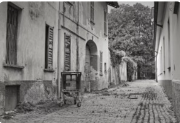
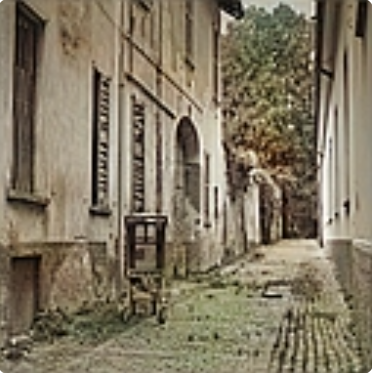

#  Image Colorization using U-Net

A Deep Learning project that automatically colorizes grayscale images using a U-Net architecture built with TensorFlow and Keras.

The model learns color patterns from color images and predicts RGB colors for previously unseen grayscale images.

---

##  Problem Statement

Old photographs and grayscale images lack color information. Manually colorizing such images is time-consuming and requires artistic expertise.

This project uses a U-Net Convolutional Neural Network to learn the relationship between grayscale intensity values and corresponding color information, enabling automatic image colorization.

---

##  Features

* Automatic grayscale image colorization
* U-Net based encoder-decoder architecture
* TensorFlow/Keras implementation
* Streamlit web application
* Real-time image upload and prediction
* End-to-end deep learning pipeline
* Local script-based inference support

---

##  Sample Results

### Input Grayscale Image




### Model Prediction



---

##  Model Architecture

The model is based on the U-Net architecture consisting of:

### Encoder

* Convolution Layers
* ReLU Activations
* Max Pooling Layers

### Bottleneck

* Deep Feature Extraction

### Decoder

* Transposed Convolutions
* Skip Connections
* Feature Reconstruction

### Output Layer

* RGB Color Image (128 × 128 × 3)

The skip connections help preserve spatial information and improve color reconstruction quality.

---

##  Project Structure

```text
IMAGE_COLORIZATION_PROJECT/
│
├── images/
│   ├── input/
│   │   └── test1.jpg
│   │
│   ├── output/
│   │   └── colorized_test1.jpg
│   │
│   └── samples/
│       ├── grayscale.jpg
│       ├── original.jpg
│       └── prediction.jpg
│
├── models/
│   └── my_color_model.keras
│
├── notebook/
│   └── image_colorizer.ipynb
│
├── src/
│   ├── preprocess.py
│   ├── predict.py
│   └── utils.py
│
├── app.py
├── main.py
├── requirements.txt
├── README.md
└── .gitignore
```

---

##  Technologies Used

* Python
* TensorFlow
* Keras
* NumPy
* OpenCV
* Matplotlib
* Pillow
* Streamlit

---

##  Installation

Clone the repository:

```bash
git clone <repository-link>
cd image-colorization
```

Install dependencies:

```bash
pip install -r requirements.txt
```

---

## ▶ Usage

### Option 1: Run Locally

Place a grayscale image inside:

```text
images/input/
```

Run:

```bash
python main.py
```

The colorized image will be saved inside:

```text
images/output/
```

---

### Option 2: Run the Streamlit Web Application

```bash
streamlit run app.py
```

The application will open in your browser.

Upload a grayscale image and the model will generate a colorized version automatically.

---

##  Training Pipeline

1. Load color images
2. Resize images to 128 × 128
3. Normalize pixel values
4. Train the U-Net model
5. Save trained weights
6. Perform inference on unseen grayscale images

---

##  Future Improvements

* Higher resolution training (256×256 or 512×512)
* GAN-based colorization
* Video colorization
* Model optimization for mobile deployment
* Improved color realism using perceptual losses

---

##  Author

**Mahith Srikanta**

B.Tech Mathematics and Computing

Indian Institute of Technology Indore
